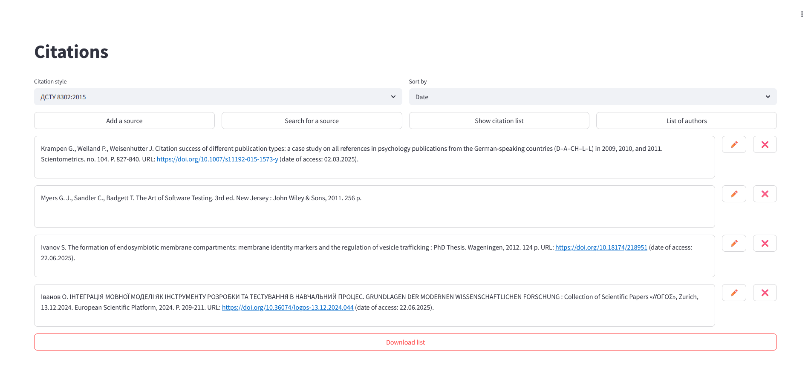
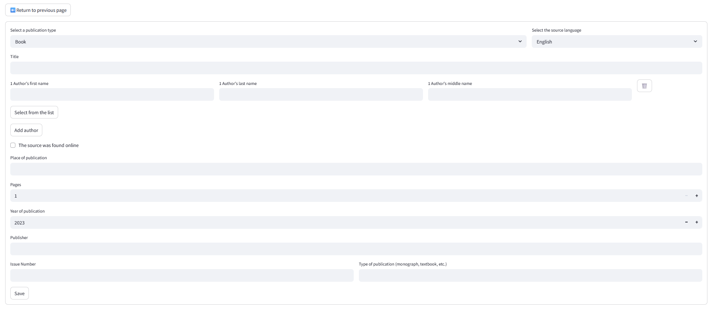
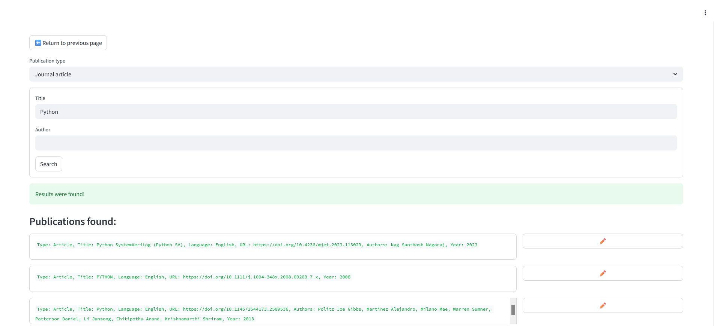

# Bibliographic Citation Manager

A Streamlit desktop-style web app for creating, storing, and exporting bibliographic citations. Built as a Bachelor's thesis project with a focus on Ukrainian academic standards (**DSTU**) alongside common international styles.

## Features

- Create and edit bibliographic entries (books, journal articles, dissertations, conference proceedings, websites)
- Format citations in **DSTU 8302:2015**, **DSTU GOST 7.1:2006**, **APA**, and **MLA**
- Persist data locally with **SQLite**
- Manage a shared authors list reused across entries
- Look up metadata via the **Crossref API** and pre-fill entry forms
- Sort by date added or alphabetically
- Export the formatted reference list as a text file
- Unit tests for citation formatters and the SQLite layer (`pytest`)

## Tech stack

| Layer | Technology |
| --- | --- |
| UI | Streamlit |
| Storage | SQLite |
| External API | Crossref Works API |
| Tests | pytest |
| Language | Python 3 |

## Screenshots

| Home | Edit | Search |
| --- | --- | --- |
|  |  |  |

## Getting started

### Prerequisites

- Python 3.10+ recommended
- Internet access (only required for Crossref search)

### Install

```bash
python -m venv venv

# Windows
venv\Scripts\activate

# macOS / Linux
source venv/bin/activate

pip install -r requirements.txt
```

### Configure Crossref (optional but recommended)

Crossref asks clients to send a contact email in the `mailto` query parameter.

```bash
cp .env.example .env
```

Edit `.env` and set your email:

```env
CROSSREF_MAILTO=you@example.com
```

If `.env` is missing, the app falls back to a placeholder address.

### Run

```bash
python -m streamlit run index.py
```

Or use the helper scripts:

- Windows: `run.bat`
- macOS / Linux: `./run.sh`

The app opens in your browser. Citation data is stored in `citations.db` in the project root (gitignored).

### Run tests

```bash
pip install -r requirements.txt
pytest
```

The suite covers citation formatting (DSTU / APA / MLA) for books, articles, and websites, plus SQLite insert / fetch / soft-delete behavior.

## Project structure

```text
.
├── index.py                 # Home page: list, sort, export
├── pages/
│   ├── edit_page.py         # Create / edit an entry
│   ├── search_page.py       # Crossref metadata search
│   └── authors_page.py      # Author management
├── utils/
│   ├── citation_types.py    # Entry models and citation formatters
│   ├── citation_bits.py     # Shared helpers (abbreviations, specialties)
│   ├── database.py          # SQLite access layer
│   └── page_generator.py    # Dynamic edit forms and validation
├── tests/                   # Unit tests (pytest)
├── requirements.txt
├── pytest.ini
├── .env.example
└── run.sh / run.bat
```

## Architecture

1. **Models** in `utils/citation_types.py` represent source types and render style-specific citation strings.
2. **SQLite** (`utils/database.py`) stores citations and authors, including soft-delete for entries.
3. **Streamlit pages** handle CRUD UI, sorting, and export.
4. **Crossref integration** maps API payloads into the same model objects used by the edit form.


## License

MIT — see [LICENSE](LICENSE).
